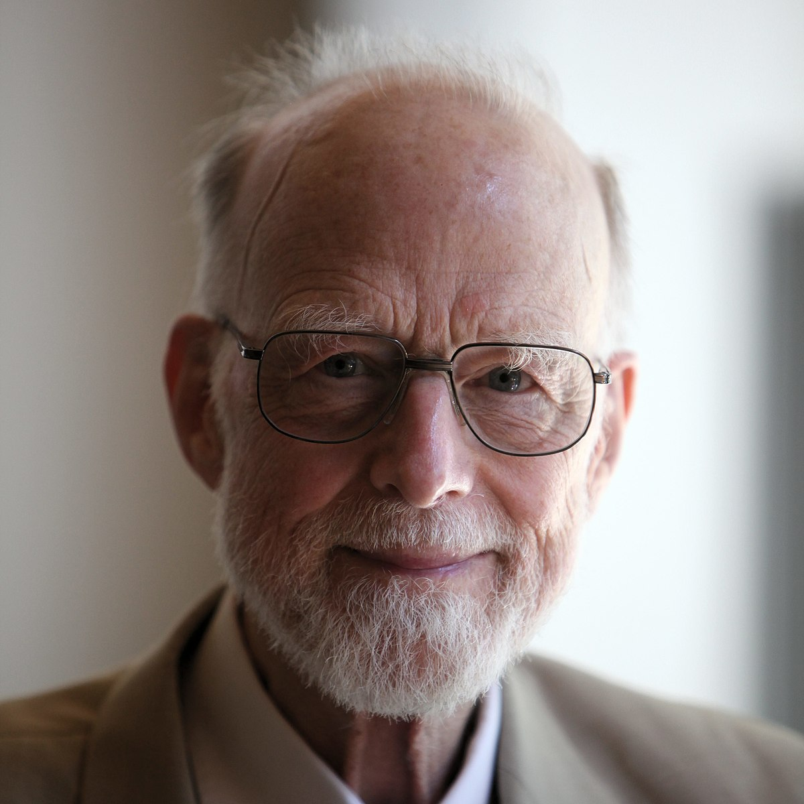
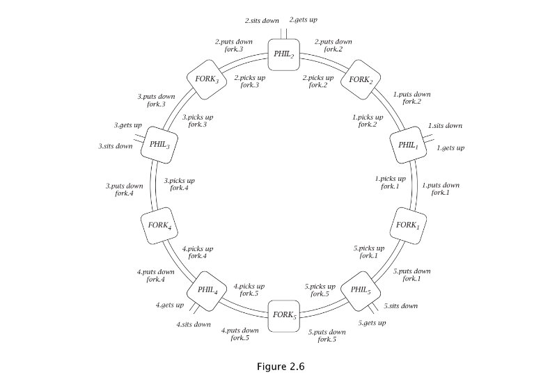

# philosophers
This project aims to create a simulation of the famous 'Dining Philosophers' problem. In computer science, the dining philosophers problem is an example problem often used in concurrent algorithm design to illustrate synchronization issues and techniques for resolving them. It was originally formulated in 1965 by Edsger Dijkstra as a student exam exercise, presented in terms of computers competing for access to tape drive peripherals. Soon after, Tony Hoare gave the problem its present form.

  

    
    
Edsger Dijkstra

  

  

    
    
Tony Hoare

  

"In ancient times, a wealthy philanthropist endowed a College to accommodate five eminent philosophers. Each philosopher had a room in which he could engage in his professional activity of thinking; there was also a common dining room, furnished with a circular table, surrounded by five chairs, each labelled by the name of the philosopher who was to sit in it. The names of the philosophers were PHIL0, PHIL1, PHIL2, PHIL3, PHIL4, and they were disposed in this order anticlockwise around the table. To the left of each philosopher there wa laid a golden fork, and in the centre stood a large bowl of spaghetti, which was constantly replenished"\
Communicating Sequential Processes\
C. A. R. Hoare

  
  
Philosophers Table

##### Rules of the simulation:
- One or more philosophers sit at a round table. There is a large bowl of spaghetti in the middle of the table.
- The philosophers alternatively eat, think, or sleep. \
While they are eating, they are not thinking nor sleeping; \
while thinking, they are not eating nor sleeping; \
and, of course, while sleeping, they are not eating nor thinking.
- There are also forks on the table. There are as many forks as philosophers.
- Because serving and eating spaghetti with only one fork is very inconvenient, a philosopher takes their right and their left forks to eat, one in each hand.
- When a philosopher has finished eating, they put their forks back on the table and start sleeping. Once awake, they start thinking again. The simulation stops when a philosopher dies of starvation.
- Every philosopher needs to eat and should never starve.
- Philosophers don’t speak with each other.
- Philosophers don’t know if another philosopher is about to die.
- No need to say that philosophers should avoid dying.

